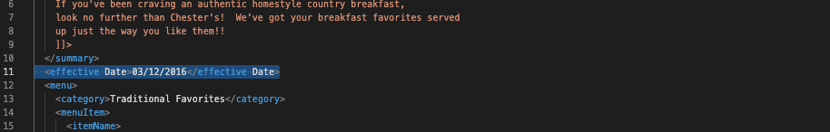
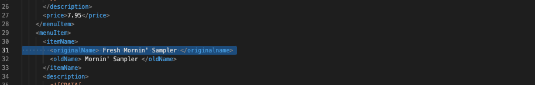
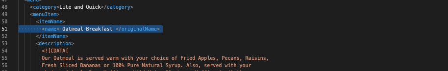
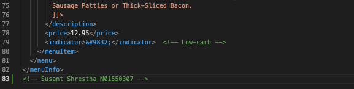
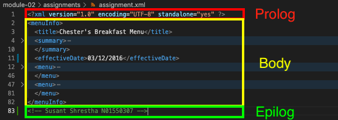
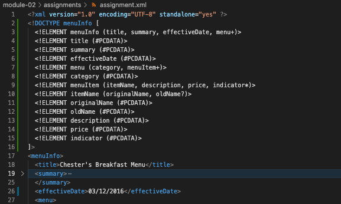
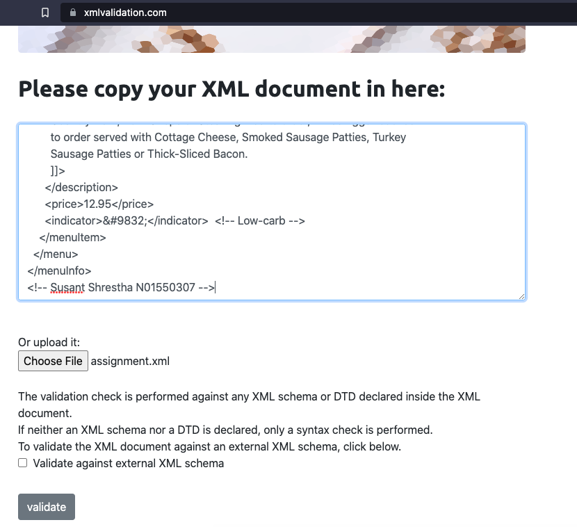
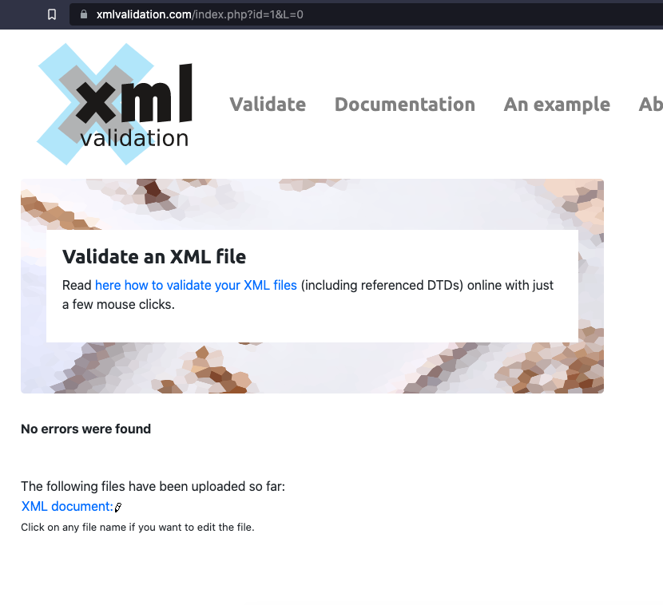
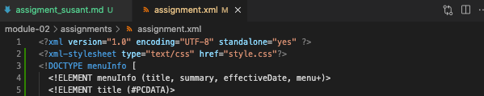
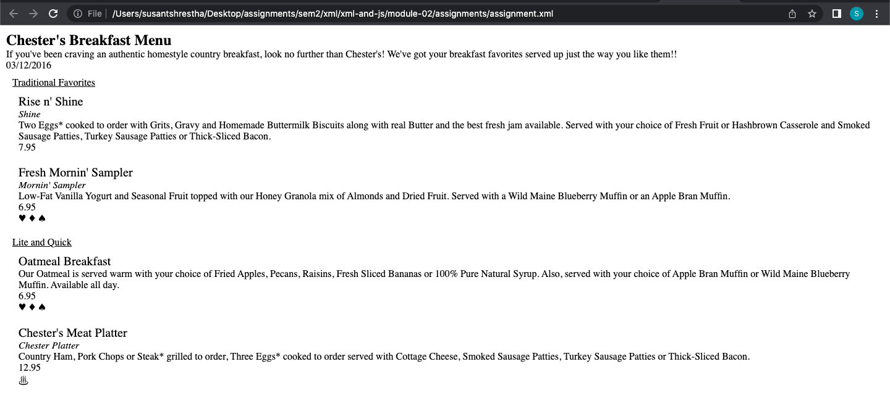

# Assignment 1

1. Open `module-2/assignments/assignment.xml` in your browser. Are there any errors? Explain the error and fix it.

- There is a space in the element name `<effective Date>03/12/2016</effective Date>` . So when validating it is viewed as an invalid attribute.
  
- There is a typo in the closing tag of the element `<originalName> Fresh Mornin' Sampler </originalname>` and `<name> Oatmeal Breakfast </originalName>`. In XML, the tags are case sensitive i.e, opening and closing tag must be exactly the same.  
  
  

2. What is the use of CDATA block in this document?

- In this document, the CDATA blocks are being used to include descriptions of menu items having to escape any special characters that might be included in the descriptions. The data within the CDATA block is not processed by the parser and is passed through as it is making it possible to use characters and symbols that would be treated as markup otherwise.

3. Add comment line to the end of file which contains you name and student id.

- 

4. Identify prolog, document body, and epilog in the document. Are there any processing instructions?

- The prolog of this document is the line `<?xml version="1.0" encoding="UTF-8" standalone="yes" ?>`.
- The document body is everything between the prolog and the epilog, which is the information about the menu.
- The epilog of this document is the last line `<!-- Susant Shrestha N01550307 -->`, which is a comment.
- There is no processing instruction found in this document.
- 

5. Add inline DTD for this document.

- 

6. Verify that file is well-formed and valid.

- 
  

7. Create `style.css` file and link it to the file. Add the following styles to the .css:

- [x] Change font-size of `originalName`
- [x] Display each `category` on the new line
- [x] Add any other css-rule

- 
  
  
