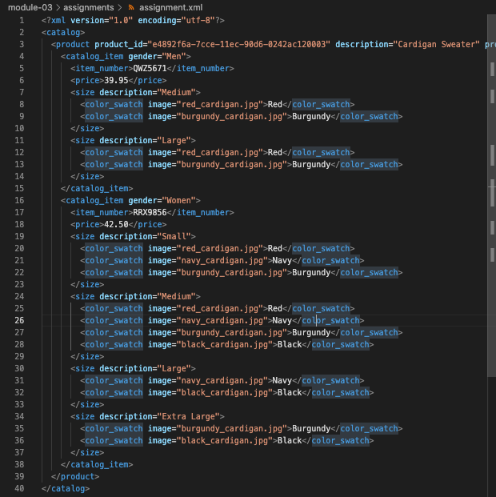
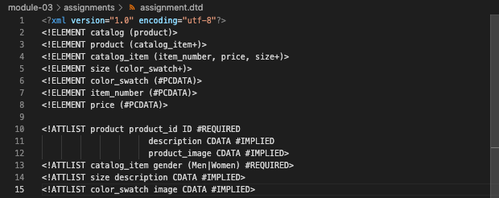
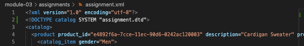
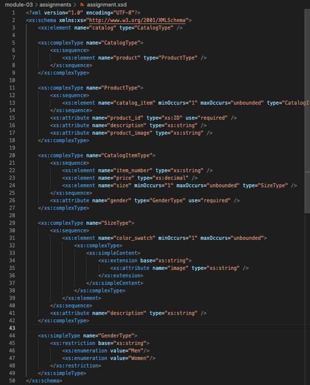
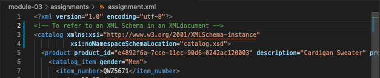
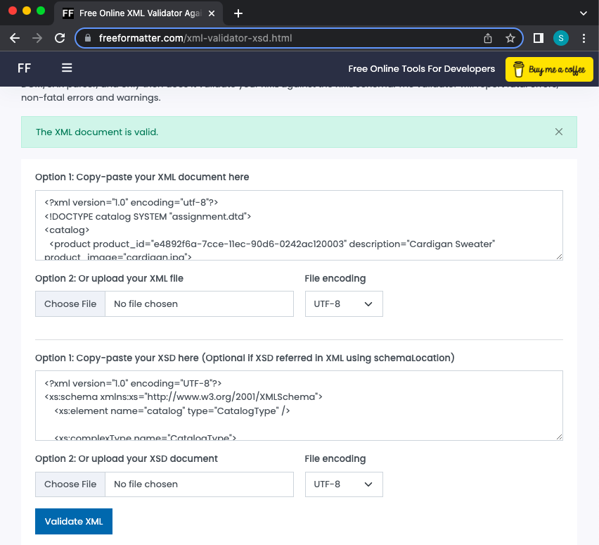

# Assignment 1

1. Open `module-3/assignments/assignment.xml` in your editor

- 

2. Create DTD for this file and validate it using any of the tools we used

- 
- 

3. Create XSD for this file and validate it using any of the tools we used

- 
- 
- 

4. Explain your thought process for these 2 declarations

- While both can be used to define the structure and elements of an XML document, I think XSD is more powerful and expressive than DTD, as XSD provides a more robust way of defining the elements, attributes, and data types of an XML document, while DTD is limited in its capabilities.
