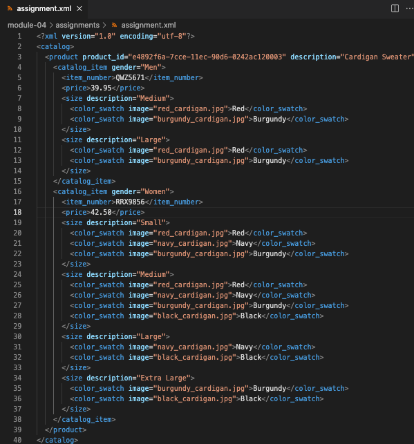
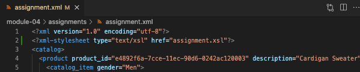
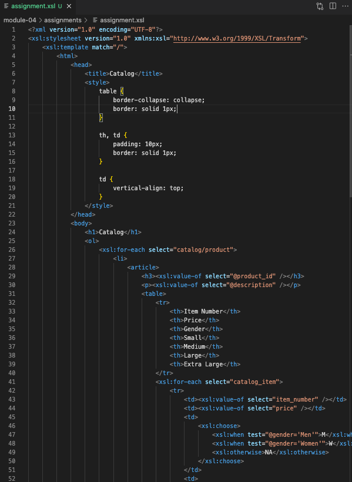
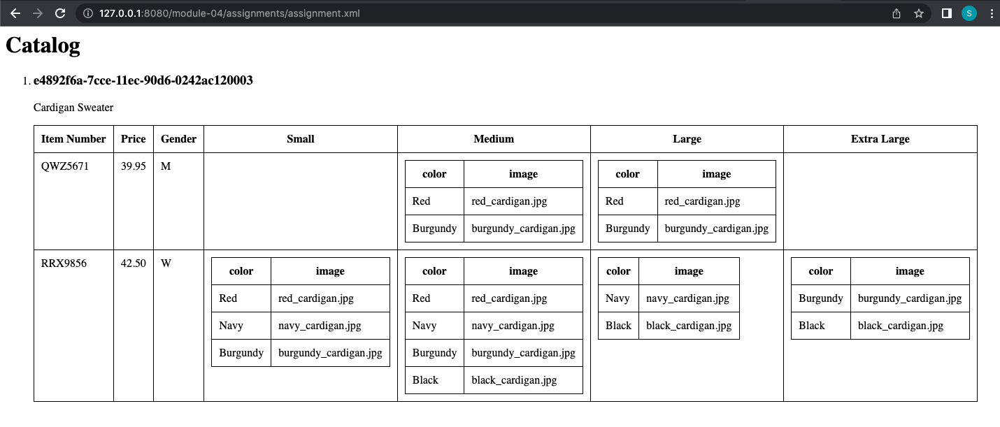

# Assignment

1. Open `module-4/assignments/assignment.xml` in your editor

- 

2. Create xsl file and add link to it

- 
- 

3. Display catalog in the following way

- [x] main title is "Catalog"
- [x] use html list tag to display catalog
- [x] render each item as `<article>` inside list item tag
- [x] display product id as h3
- [x] display product description as paragraph
- [x] render table of catalog items with columns: item number, price, gender, small, medium, large, extra large (if column item is not present in item, then display empty cell)
- [x] for gender column render M for Men, W for Women
- [x] inside size columns (small, medium, large, and extra large) display subtable with 2 columns: color and image

- 

4. Explain your thought process in it.

- We first determine which elements in XML document are needed for the desired output, and then we write XPath expressions to select those elements. After that we write XSLT templates to define how the selected elements should be transformed into the desired output formats, such as HTML, text etc. In order word, XSLT transforms XML documents into the desired output format by using XPath expressions to select elements and XSLT templates to define the transformation of those elements.
