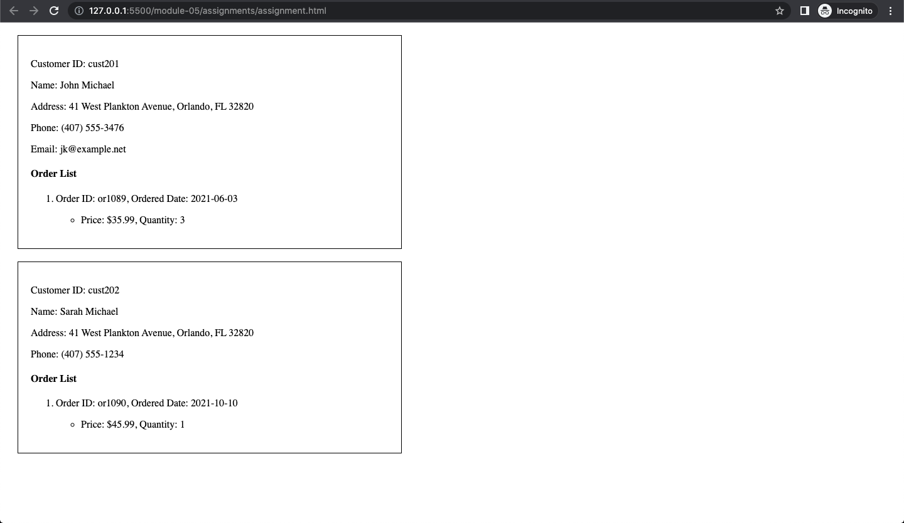

# Assignment

- [x] Create empty html file
- [x] Create empty script tag
- [x] Read data from `customers.xml`
- [x] Create function to render customers from loaded file into html in any format (it can be a table, or a list, or just plain divs)

