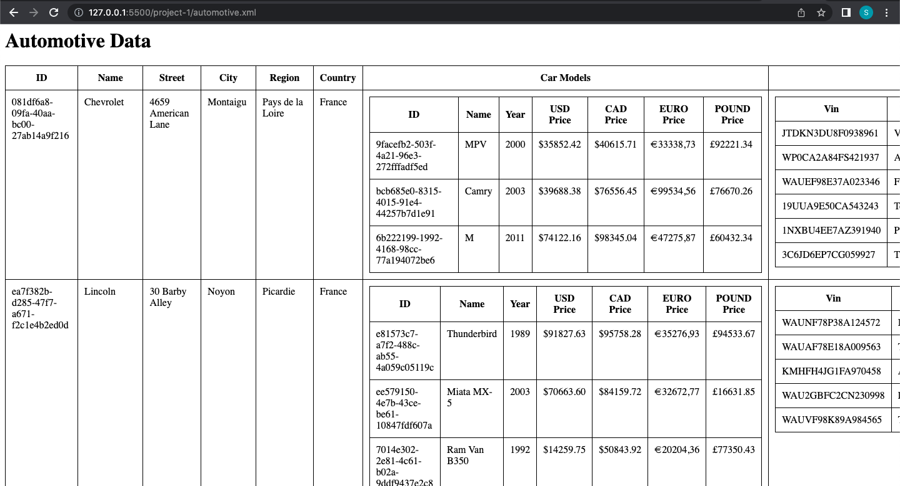
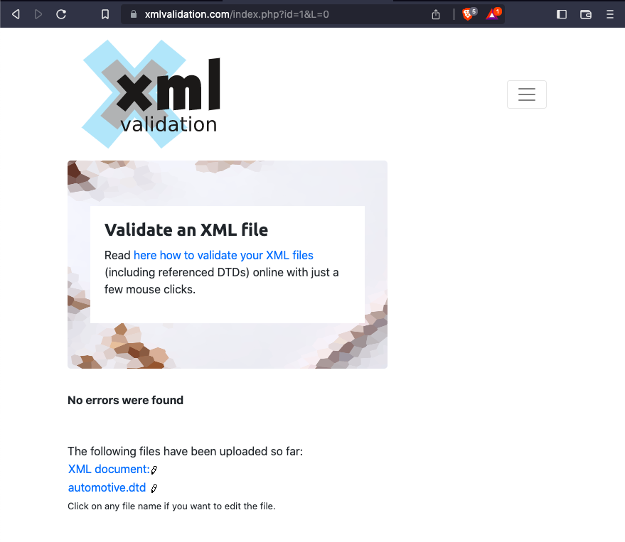
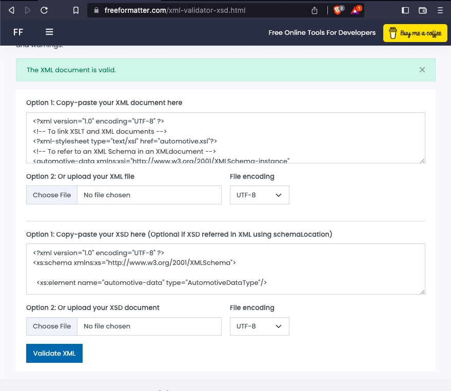

## Susant Shrestha (N01550307)

### My contributions in this project

- [x] Worked on creating the xslt to display data in the table format.

  - Created the automotive.xsl and linked it with the xml files.

- [x] Review other team members codes, fixed the issues and properly managed the code.

  - Created the external automotive.dtd file to separate the dtd from xml and linked with xml in automotive-dtd.xml file.

  - Renamed the type names in xsd.

  - Linked the xsd with xml in automotive-xsd.xml

  - Fixed the issues of naming conflict of id and name.

  - Added missing closing tag in xml.

- [x] Performed validation check of dtd and xsd.

### Screenshots

- 
- 
- 
