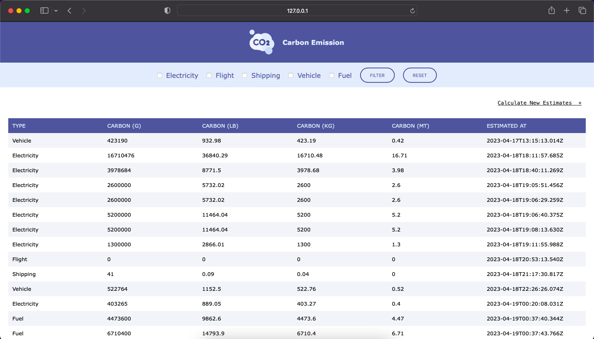
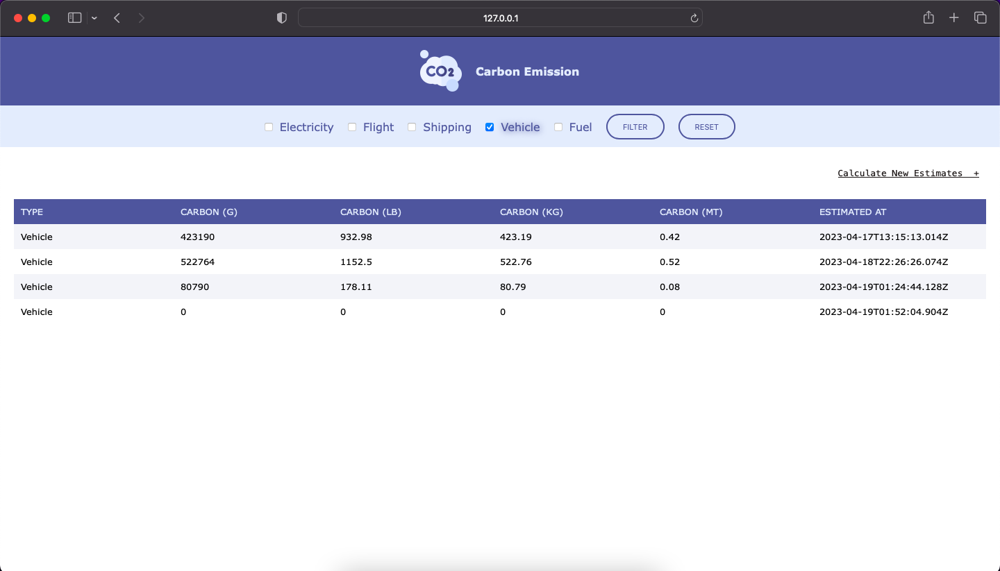
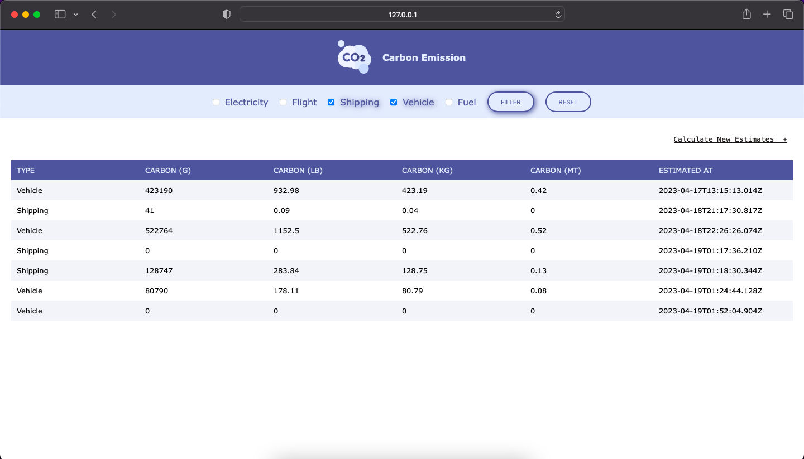
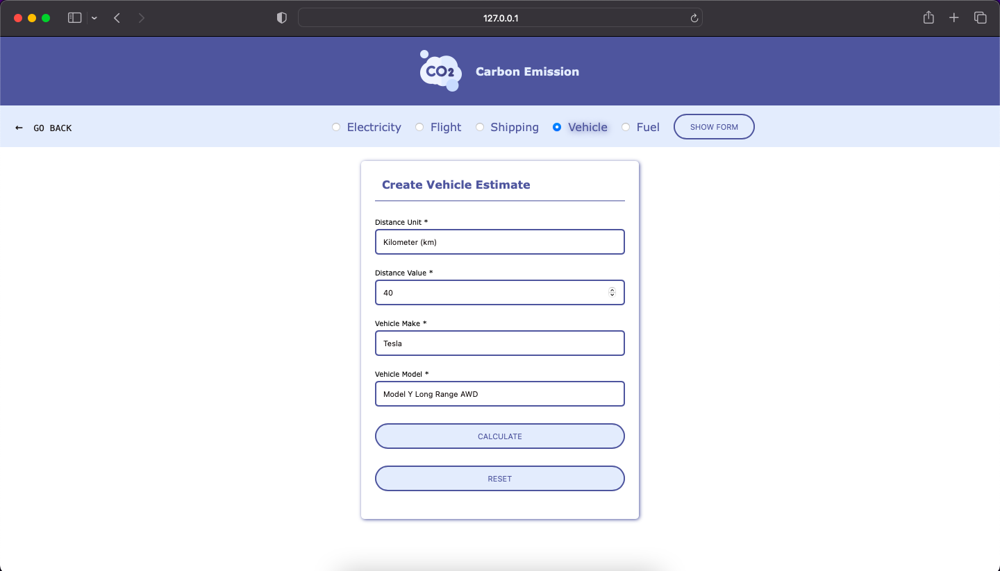
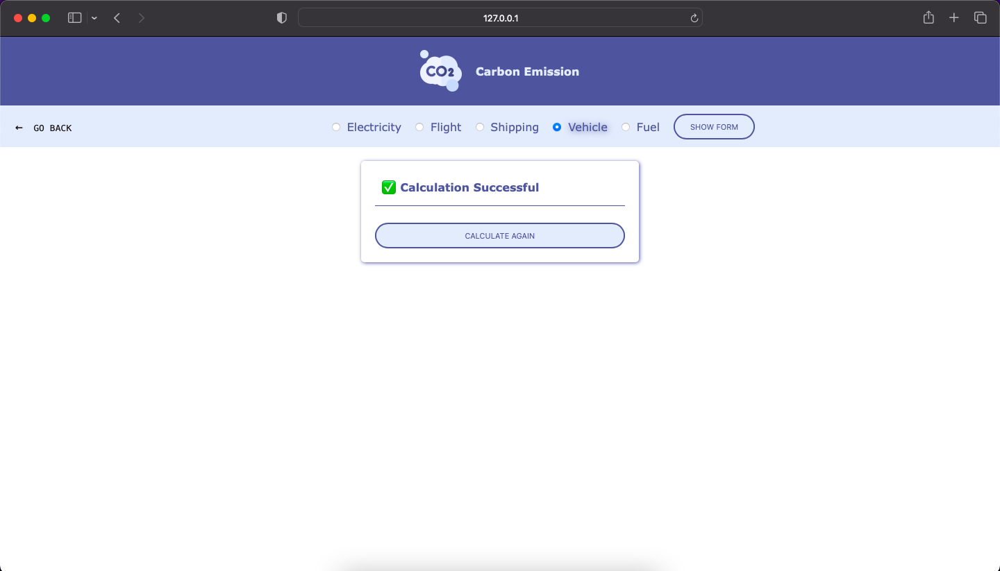

## Susant Shrestha (N01550307)

### My contributions in this project

- [x] Review other team members codes and added the enhancment features.

  - Added feature to calculate the amount of emission for electricity, flights, shipping and fuel combustion.

  - Created the new wireframe for the application to include the new features.

  - Created html and css to implement the new wireframe.

  - Created js asynchronous functions to make the api calls.

  - Created local states to avoid fetching data which are already fetched.

  - Created js functions to render the data in html.

### Screenshots

- 
- 
- 
- 
- 
